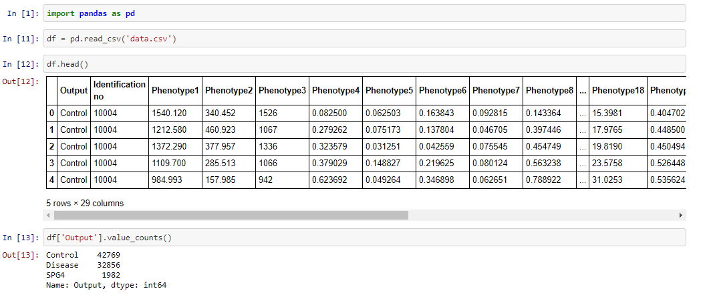
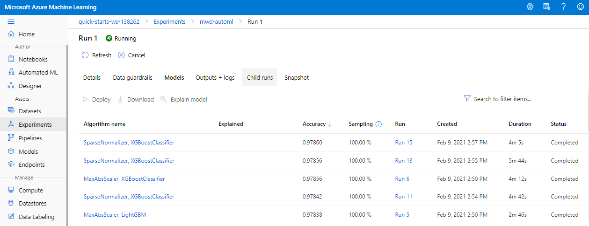
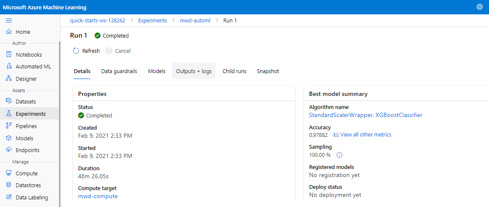
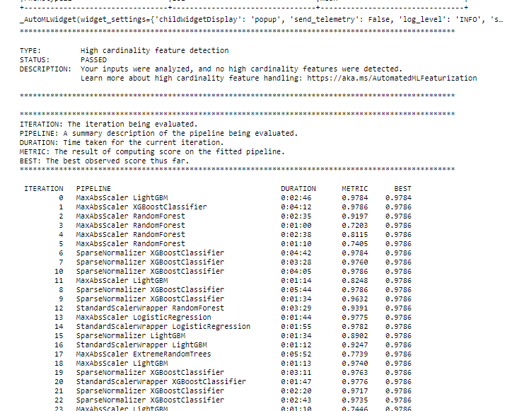
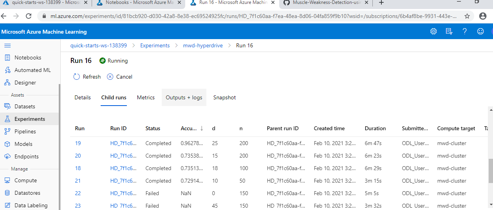
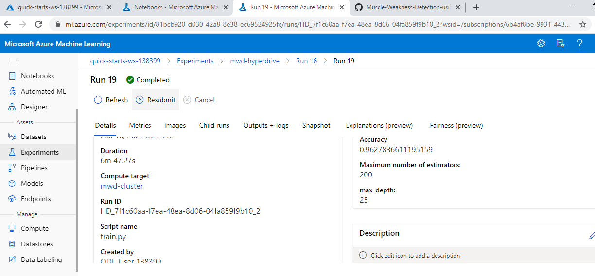
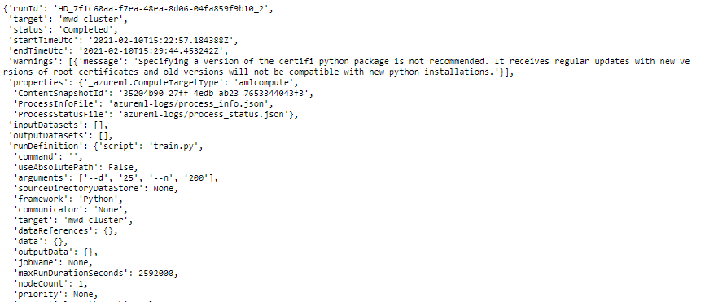

# Muscle Weakness Detection using Microsoft Azure

In this project, we are going to train a model to detect progressive muscle weakness's status through multiple phenotype readings using Azure's AutoML and Hyperdrive process. After the training, we are going to deploy the best model and consuming it to check the working of endpoint.

## Dataset
### Overview

In this project, we are going to classify the progressive muscle weakness and disease with the use of HyperDrive and AutoML.

The dataset is custom data curated from one of the health institution.

The dataset contains 3 categories:
- Control
    
    Indicates whether muscle weakness is in control or not.
    
    
- SPG4
    
    **S pastic paraplegia 4 (SPG4)** is the most common type of hereditary spastic paraplegia (HSP) inherited in an autosomal dominant manner. Disease onset ranges from infancy to older adulthood. SPG4 is characterized by slowly progressive muscle weakness and spasticity (stiff or rigid muscles) in the lower half of the body. In rare cases, individuals may have a more complex form with seizures, ataxia, and dementia. SPG4 is caused by mutations in the SPAST gene. Severity of symptoms usually worsens over time, however some individuals remain mildly affected throughout their lives. Medications, such as antispastic drugs and physical therapy may aid in stretching spastic muscles and preventing contractures (fixed tightening of muscles) 
    
    Source : https://rarediseases.info.nih.gov/diseases/4925/spastic-paraplegia-4
    
    
- Disease
   
   Indicates that the muscle weakness is there due to some desease.




The above screeenshot provides information about some features and observation and total counts of target variable.

### Task
We are going to predict the status of muscle's weakness of the body. Human muscles are one of those part which gets started to weaken from the born. After some years, the muscles tissues starts to stiff. In  this case, we have to take more care of this muscles. Though, If we detect the status of muscle weakness in early stage then we might save many people from the illness cause by these muscles.

Here in this project, we are using HyperDrive and AutoML to train and to get the best model which is appropriate for the dataset.

### Access
The dataset is private. Hence to make the use of getting the data from the thirdparty, we used ngrok to host the data like following URL.
```python

path = "https://0547078f50ce.ngrok.io/data.csv"

```
and then using **TabularDatasetFactory** to retrive the data in workspace.

```python

ds = TabularDatasetFactory.from_delimited_files(path,
                                                validate=True,
                                                include_path=False,
                                                infer_column_types=True,
                                                separator=',',
                                                header=True,
                                                support_multi_line=False,
                                                empty_as_string=False)
```

## Automated ML
We have used following setting to train an AutoML model.

```python
automl_settings = {
    "experiment_timeout_minutes": 30,
    "primary_metric": 'accuracy',
    "n_cross_validations": 5,
    "max_concurrent_iterations": 4,
    "enable_early_stopping": True,
    "enable_voting_ensemble": False,
    "enable_stack_ensemble": False
}

automl_config = AutoMLConfig(task="classification",
                            compute_target=cpu_cluster,
                            training_data=ds,
                            label_column_name="Output",
                            **automl_settings)

```
As you can see in above config, Our primary metric is **accuracy** which is the target for AutoML to improve also we have specified some params like following.
- *experiment_timeout_minutes*: To stop our process after 30 minutes.
- *n_cross_validations*: To do 5 fold validation on dataset
- *max_concurrent_iterations*: To achieve concurrency, we have specified 4 as count to use that number of cluster to run the process concurrently
- *enable_early_stopping*: We made this param as True to stop the process early, if model is not improving after some iterations,
- *enable_voting_ensemble*: We made this param as False as we don't want combination of diffrent algorithm as output.
- *enable_stack_ensemble*: We made this param as False as we don't want stack of diffrent algorithm as output.


### Results
We got **97.86**% accuracy with automated ML model.
The params of the best model (**XGBoostClassifier**) is following.

```python
XGBoostClassifier(base_score=0.5, booster='gbtree', colsample_bylevel=1,
                    colsample_bynode=1, colsample_bytree=0.9, eta=0.001, gamma=0,
                    grow_policy='lossguide', learning_rate=0.1, max_bin=255,
                    max_delta_step=0, max_depth=10, max_leaves=7,
                    min_child_weight=1, missing=nan, n_estimators=100, n_jobs=1,
                    nthread=None, objective='multi:softprob', random_state=0,
                    reg_alpha=0, reg_lambda=0.20833333333333334,
                    scale_pos_weight=1, seed=None, silent=None, subsample=0.6,
                    tree_method='hist', verbose=-10, verbosity=0))
```

However, we could improved this model through removing some features from our dataset which are not that important in making the decision.

###### Best Model



The above screeenshot provides information about AutoML experiment in Running state where we can find out some ML model's details that were complete.



The above screeenshot provides information about AutoML experiment in Completed state where we can find out the best model which is XGBoost in our case.

###### AutoML Widget



The above screeenshot provides information about logs recorded in Run Widget.

## Hyperparameter Tuning

We have used RandomForestClassifier algorithm as we are solving the "classification" problem. RandomForest is consist of multiple DecisionTrees algorithm which play an important part in the output of the RandomForest.

We have applied an eary stopping policy to stop the training process after it starts to degrading the accuracy with increased iteration count.

For the hyperparam tuninng, we have used RandomParameterSampling where we used random depth upto 50 for the model and also given some choices ranging from 50 to 250 for the number of estimators param of the model.


<u>Code Snippet:</u>

```python

param_sampling = RandomParameterSampling({
    "d": randint(50),
    "n": choice(50,100,150,200,250)
});


hyperdrive_run_config = HyperDriveConfig(run_config = estimator, 
                             hyperparameter_sampling = param_sampling,
                             policy = early_termination_policy,
                             primary_metric_name = 'Accuracy', 
                             primary_metric_goal = PrimaryMetricGoal.MAXIMIZE, 
                             max_total_runs = 20,
                             max_concurrent_runs = 5)

```

The primary metric for our algo is "Accuracy". The hyperdrive willl try to improve the accuracy by giving provided choices of hyperparams. We also specified max_total_runs param which denotes as a param to run number of iteration to complete the hyper drive for training the model. Also we have provided "max_concurrent_runs" option to run the iterations of hyperdrive paralley so the process gets complete faster.

### Results

We got **96.27** accuracy with following paramerters

    ['--d', '25', '--n', '200'] 

However, we could improved this model through adding more hyperparams for the model so that we may achieve some more accuracy.



The above screenshot it about HyperDrive in running state where we can see the completed iterations with achieved accuracy in each iteration.



The above screenshot is about completed HyperDrive experiment where we can get the best model's hyperparams which is 200 number of estimators with 25 depth.

###### HyperDrive Widget



The above screeenshot provides information about logs recorded in Run Widget.

## Model Deployment

We have deployed the (XGBoostClassifier) model who got 97.86 through Automated ML experiment. We also have provided sample python file named [endpoint.py](./endpoint.py)
where we have to specify our endpoint URL and authentication key to make successful rest api call.

We also provided the sample input data in following json structure to query the endpoint.

```python

data = {
    "data":
    [
        {
            'Phenotype1': "0",
            'Phenotype2': "0",
            'Phenotype3': "0",
            'Phenotype4': "0",
            'Phenotype5': "0",
            'Phenotype6': "0",
            'Phenotype7': "0",
            'Phenotype8': "0",
            'Phenotype9': "0",
            'Phenotype10': "0",
            'Phenotype11': "0",
            'Phenotype12': "0",
            'Phenotype13': "0",
            'Phenotype14': "0",
            'Phenotype15': "0",
            'Phenotype16': "0",
            'Phenotype17': "0",
            'Phenotype18': "0",
            'Phenotype19': "0",
            'Phenotype20': "0",
            'Phenotype21': "0",
            'Phenotype22': "0",
            'Phenotype23': "0",
            'Phenotype24': "0",
            'Phenotype25': "0",
            'Phenotype26': "0",
            'Phenotype27': "0",
        },
    ],
}

```

## Screen Recording

[](https://youtu.be/fU-olKCBjyU)

URL: [https://youtu.be/fU-olKCBjyU](https://youtu.be/fU-olKCBjyU)


## Standout Suggestions
- We used private clinical data which was in its RAW format and we never thought to build model with this data.
Now after applying this medical data, we amazed with the results we got in very minimum time.

- As we have to use thirdparty dataset, we have hosted this data in local computer and hosted that file for publich through ngrok and the accessed that file in azure through ngrok URL.

    path = "https://3366d6aa338e.ngrok.io/data.csv"

    (Note: The above path is temporary and it will be expired after sometime)